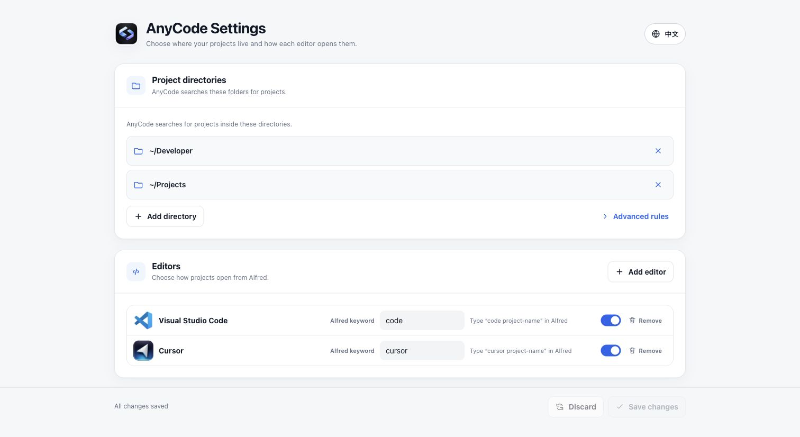

# Alfred AnyCode

Search projects in Alfred and open them with any configured macOS editor.

## Setup

Install [Node.js 20 or later](https://nodejs.org/) before using the workflow. Alfred 5.1 or later with the Powerpack is required.

## Usage

Search projects and open the selected result via an editor keyword, such as `code` or `cursor`. Every editor has its own configurable keyword.

- <kbd>↩</kbd> Open the project in the selected editor.
- <kbd>⌘</kbd><kbd>↩</kbd> Reveal the project in Finder.
- Append `:refresh` to rebuild the project cache, for example `code :refresh`.

Open AnyCode Settings via the `anycode` keyword to choose project directories, editors, and keywords.



## Configuration

AnyCode Settings has two focused sections:

- **Project directories** uses the native macOS directory picker. Expand **Advanced rules** to edit glob patterns directly.
- **Editors** configures one Alfred keyword per editor. Visual Studio Code and Cursor are included by default; Zed, WebStorm, Codex, and other macOS applications can be added.

Installed editors are detected through known application paths and Spotlight. Editors can be enabled, disabled, or removed without affecting the shared project list. Click an editor icon or drop a PNG, JPEG, WebP, GIF, or ICNS image onto it to replace the artwork. Choosing another macOS application imports its Finder icon automatically.

The settings page is available in English and Chinese and remembers the selected language. Invalid, duplicate, empty, and reserved keywords are reported inline before saving.

## Installation

[Download the latest Alfred workflow](https://github.com/wilsonyiyi/alfred-anycode/releases/latest/download/Alfred-AnyCode.alfredworkflow), then double-click it to install in Alfred.

Alternatively, install or update from npm:

```sh
npm install --global alfred-anycode
```

The npm installer creates one package-owned symbolic link in Alfred’s active preferences directory. It never replaces an existing workflow directory or a link to another target. Run it as your macOS user, without `sudo`.

For local development, clone the repository into an Alfred workflow folder, run `npm install`, and open the workflow in Alfred Preferences. The source workflow uses the development-only Bundle ID `com.wilsonyiyi.alfred-anycode.dev`, so it can coexist with an installed release.

## Features

- Use multiple editors at the same time with independent Alfred keywords.
- Add project folders through the native picker or advanced glob rules.
- Search project names and paths with Unicode-aware fuzzy matching.
- Cache project discovery for fast repeated searches.
- Add supported or custom macOS applications dynamically.
- Use built-in application artwork or custom drag-and-drop icons.
- Configure the workflow in English or Chinese.

## Architecture

- `index.js`: Alfred Script Filter composition root.
- `src/config`: Versioned editor configuration, migration, persistence, and Alfred keyword synchronization.
- `src/config-ui`: Local settings server and responsive grouped interface.
- `src/projects`: Project discovery and cache policy.
- `src/search`: Project ranking and Unicode-aware matching.
- `src/ides`: Keyword-to-editor registry and per-editor icon resolution.
- `src/actions`: Safe macOS project opening and Finder reveal actions.
- `src/alfred`: Alfred JSON item presentation.
- `src/install`: Dependency-free, non-destructive npm workflow linking.
- `src/release`: Production package and installable `.alfredworkflow` generation.

Run the full verification suite with:

```sh
npm run check
```

Build and verify the production workflow locally:

```sh
npm run build:release
npm run build:workflow
```

The production package is written to `.release/package` and the directly installable workflow to `.release/Alfred-AnyCode.alfredworkflow`. The release uses the production Bundle ID `com.wilsonyiyi.alfred-anycode`, starts with the `code` and `cursor` keywords, and includes all runtime dependencies.

## Releases

Production releases run automatically when Conventional Commits reach `main`. `semantic-release` determines the next version, updates npm and Alfred metadata, creates the Git tag and GitHub Release, uploads the installable workflow, and publishes to npm through Trusted Publishing (OIDC).

- `fix:` releases a patch version.
- `feat:` releases a minor version.
- `BREAKING CHANGE:` or `!` releases a major version.

When using squash merge, keep the pull request title in Conventional Commit format because it becomes the commit analyzed on `main`.

## License and attribution

Alfred AnyCode is licensed under GPL-3.0-or-later. It is based on [vivaxy/alfred-open-in-vscode](https://github.com/vivaxy/alfred-open-in-vscode) and retains the original project’s license.
